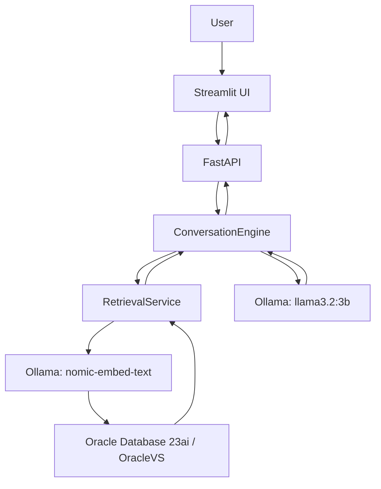

# Customer Service RAG Chatbot

A local-first customer-support assistant that answers questions from indexed
product documentation. It combines Ollama models with Oracle Database 23ai and
OracleVS, retains conversation context, and returns grounded responses with
citations to the retrieved knowledge.

## How it works



The local default uses:

- Generation: `llama3.2:3b` through Ollama.
- Embeddings: `nomic-embed-text` through Ollama (`768` dimensions).
- Vector store: Oracle Database 23ai / LangChain OracleVS with COSINE search.
- API: FastAPI; UI: Streamlit.

OCI generation and embedding adapters remain available as an optional provider
selection, but Ollama is the default.

## Repository layout

```text
src/
  api/           FastAPI routes, identity boundary, and application service
  app/           Lazy composition root
  conversation/  Multi-turn orchestration and memory adapters
  ingestion/     File loading, cleaning, metadata, chunking, and indexing bridge
  llm/           Grounded Ollama and optional OCI LLM adapters
  ollama/        Local Ollama HTTP client and health check
  proactive/     Sentiment, evidence, history, and escalation signals
  retrieval/     Embeddings, OracleVS adapter, filtering, and score conversion
  ui/            Streamlit presentation and HTTP client
  models/        Shared Pydantic contracts
docs/            Developer documentation
data/raw/        Source knowledge documents
scripts/         Manual database provisioning scripts
tests/           Unit, integration, and evaluation tests
```

## Quick start

Detailed instructions are in [docs/setup.md](docs/setup.md). From a clean
checkout:

```bash
python -m venv .venv
source .venv/bin/activate
python -m pip install -r requirements.txt

# In a separate terminal, if Ollama is not already running:
# ollama serve
ollama pull llama3.2:3b
ollama pull nomic-embed-text

cp .env.example .env
# Edit .env with your Oracle credentials and table names.
set -a
source .env
set +a

python -m src.ollama.health
```

`.env` is local-only and is deliberately **not** loaded by the application.
Never commit it. Run commands from the repository root; if Python cannot find
`src`, run `export PYTHONPATH="$PWD"` first.

Oracle Database 23ai is required for live indexing and chat. Configure the
database variables in `.env`, provision the durable-memory table if wanted,
and use a vector table compatible with `VECTOR(768, FLOAT32)`. See
[Oracle 23ai](docs/oracle-23ai.md).

## Index knowledge

Knowledge is not indexed automatically at application startup. The supported
entry point is `KnowledgeIndexer.ingest_file_and_index`, obtained from the
application composition root. For the supplied text corpus:

```bash
set -a
source .env
set +a

python - <<'PY'
from pathlib import Path

from src.app import create_application

paths = sorted(Path("data/raw/official_docs").glob("*.txt"))
with create_application() as application:
    total = 0
    for path in paths:
        documents = application.knowledge_indexer.ingest_file_and_index(path)
        total += len(documents)
        print(f"{path}: {len(documents)} chunks")
print(f"Indexed {total} chunks from {len(paths)} source files.")
PY
```

Indexing is insert-only. Re-indexing the same deterministic document IDs can
raise a duplicate-key error; use a deliberately reset or new vector table when
rebuilding a corpus. More details: [ingestion](docs/ingestion.md).

## Run the application

Start FastAPI after loading the environment:

```bash
uvicorn src.api.app:app --reload
```

`GET /health` reports process liveness without contacting Ollama or Oracle.
The production dependency graph is created lazily on the first `POST /chat`.

For a quick API check in development identity mode:

```bash
curl -i http://127.0.0.1:8000/chat \
  -H 'Content-Type: application/json' \
  -d '{"conversation_id":"local-demo-1","user_message":"What does this service support?"}'
```

The response body is the shared `ChatResponse`; the resolution state is exposed
in the `X-Resolution-Status` response header.

In a second terminal, load the same `.env` and start Streamlit:

```bash
streamlit run src/ui/app.py
```

Streamlit calls FastAPI through `HttpChatApiClient`; it does not connect to
Oracle or Ollama directly. By default it calls `http://127.0.0.1:8000`; change
`API_BASE_URL` for another API address.

Ask a specific question such as:

> What is Oracle AI Database at AWS and which AWS regions are supported?

The engine retrieves OracleVS evidence, asks the LLM for a grounded answer,
and attaches citations only for retrieved documents. If the indexed knowledge
does not contain a requested fact, the assistant says so instead of guessing.

## Conversation and retrieval behavior

The conversation engine retains prior turns, structured product/version/issue
context, troubleshooting attempts, resolution state, and ownership. It does
not require product, version, and issue type for every request:

- A self-contained information question proceeds directly to retrieval.
- An underspecified request such as “How do I fix this?” can ask a targeted
  clarification question.
- Empty, low-confidence, unavailable, or unsupported knowledge produces a
  safe fallback or escalation rather than fabricated guidance.

Retrieval embeds the query, performs COSINE vector search, normalizes Oracle
distance to a `[0, 1]` higher-is-better score, applies metadata filters, and
returns `RetrievalResult` objects. The engine—not the LLM—builds citations from
those results. See [conversation](docs/conversation.md) and
[retrieval](docs/retrieval.md).

## Test and validate

```bash
PYTHONDONTWRITEBYTECODE=1 .venv/bin/python -m pytest -p no:cacheprovider
PYTHONPYCACHEPREFIX=/tmp/customer_service_chatbot_compile_cache \
  .venv/bin/python -m compileall -q src tests
.venv/bin/python -m pip check
git diff --check
```

Unit tests are credential-free. Live Oracle/Ollama tests are opt-in; see
[testing](docs/testing.md).

## Documentation

- [Architecture](docs/architecture.md)
- [Setup](docs/setup.md)
- [Configuration](docs/configuration.md)
- [Ollama](docs/ollama.md)
- [Oracle Database 23ai and OracleVS](docs/oracle-23ai.md)
- [Ingestion and indexing](docs/ingestion.md)
- [Retrieval](docs/retrieval.md)
- [Conversation and memory](docs/conversation.md)
- [Testing](docs/testing.md)
- [Troubleshooting](docs/troubleshooting.md)
- [Evaluation](docs/evaluation.md)

## Known limitations

- Live chat requires a running Ollama instance, the two configured models, and
  reachable Oracle Database 23ai.
- The vector table must be intentionally rebuilt when embedding models change;
  equal dimensions do not make embedding spaces compatible.
- `ANALYTICS_MODE=memory` and in-memory conversation memory are process-local.
- Development identity is not production authentication. Production must set
  `API_AUTH_MODE=required` and install trusted authentication middleware.
- Evaluation collects results; it does not retrain models, alter prompts, or
  modify production knowledge automatically.

## Extending safely

Use the shared Pydantic models and narrow interfaces between modules. Inject
test doubles through `src.app.create_application()` rather than adding direct
Oracle/Ollama calls to API routes or Streamlit. Preserve the `Retriever`,
`LLMService`, `ConversationMemory`, and proactive-provider boundaries when
adding a provider or storage implementation.
