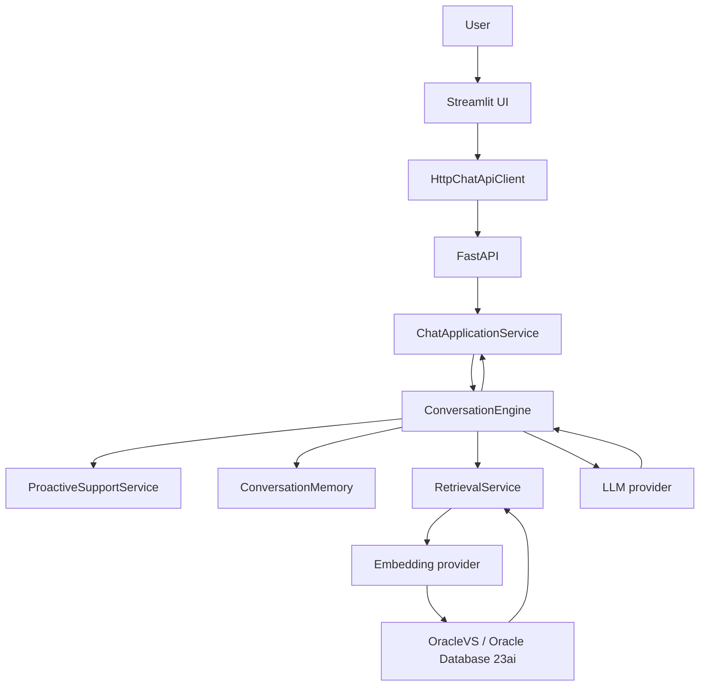

# Architecture

The application is a retrieval-augmented customer-support chatbot. Business
logic lives in `src/`; FastAPI routes and Streamlit rendering are intentionally
thin.

## Layers

| Layer | Location | Responsibility |
| --- | --- | --- |
| UI | `src/ui/` | Presents chat, citations, feedback, and local analytics; calls FastAPI only. |
| API | `src/api/` | Authenticated identity boundary, request validation, error mapping, and HTTP contracts. |
| Composition | `src/app/bootstrap.py` | Lazily wires Oracle, models, retrieval, memory, proactive support, and conversation services. |
| Conversation | `src/conversation/` | Context, clarification, state transitions, retrieval orchestration, grounding, and citations. |
| Ingestion | `src/ingestion/` | Loads files, cleans text, extracts metadata, chunks content, and invokes the indexing port. |
| Retrieval | `src/retrieval/` | Embedding calls, OracleVS insertion/search, exact metadata filtering, score normalization. |
| LLM | `src/llm/` | Builds grounded prompts and validates structured model output. |
| Memory | `src/conversation/` | In-memory development state or Oracle-backed durable state with optimistic concurrency. |
| Analytics | `src/analytics/` | Best-effort support-outcome and feedback events; does not control chat behavior. |
| Configuration | `src/config.py` | Reads environment variables only; it creates no external clients. |

## Runtime composition

Importing `src.app` or `src.api.app` does not connect to external services.
`create_application()` builds the dependency graph when called. The FastAPI
runtime invokes it lazily on its first chat request, then reuses its services
until shutdown.

With default configuration, the graph uses Ollama for both embeddings and
generation, OracleVS for retrieval, `ProactiveSupportService` for optional
evidence and escalation signals, and Oracle-backed memory only when
`ORACLE_CONVERSATION_TABLE` is configured.

Tests can inject a retriever, LLM, memory, proactive service, analytics sink,
or Oracle/Ollama client into `create_application()` without external calls.

## Data flow

1. Ingestion turns a supported file into deterministic `KnowledgeDocument`
   chunks with structured metadata.
2. `KnowledgeIndexer` passes those documents to `RetrievalService`.
3. OracleVS embeds indexed text through the configured embedding adapter and
   stores it in the Oracle vector table.
4. A chat turn is authenticated at the API boundary and passed to
   `ConversationEngine`.
5. The engine updates state, optionally asks for clarification, retrieves
   evidence, and passes that evidence to the LLM grounding adapter.
6. The engine returns a `ChatResponse` and builds citations from the retrieved
   document IDs and source metadata. The LLM never creates citation objects.

See [configuration](configuration.md) for provider selection and
[conversation](conversation.md) for state behavior.
